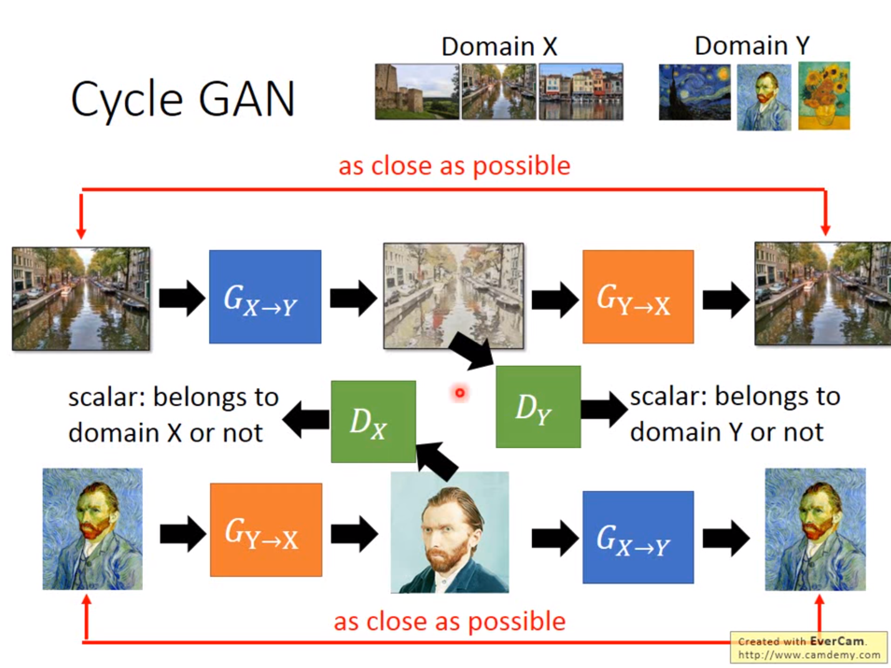

# CycleGAN_practice
图像风格迁移算法CycleGAN复现练习

### 下载数据集
```
$ mkdir datasets
$ chmod u+x download_dataset
$ ./download_dataset        
$ ./download_dataset apple2orange  # 下载数据集
```
### 训练
```
python train.py
```

### 测试
```
python test.py
```

80个epochs的训练模型已被保存在saved_model文件夹下，直接加载模型可测试。

All in ```CycleGAN.ipynb```.

论文地址: https://arxiv.org/pdf/1703.10593.pdf

official: https://github.com/junyanz/CycleGAN



